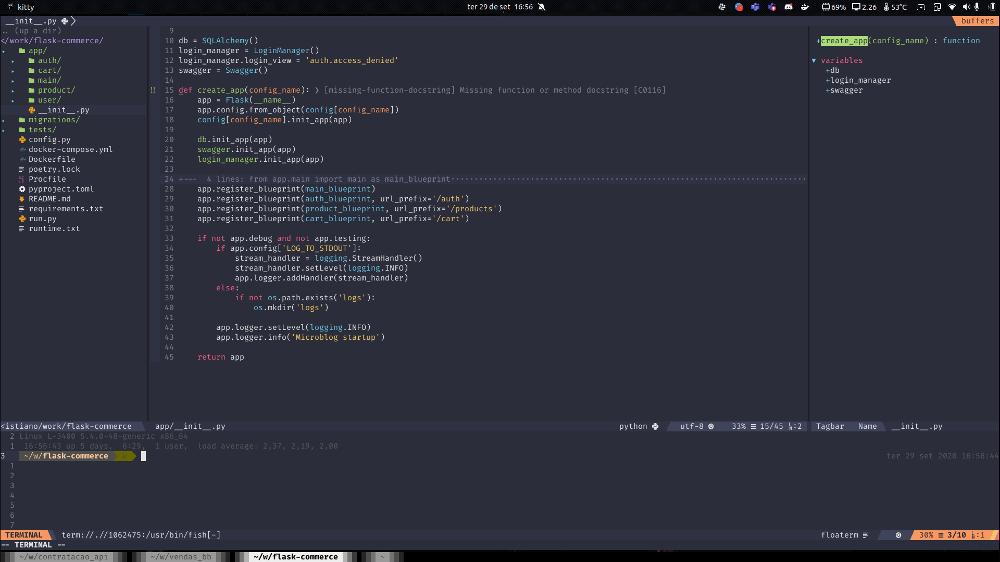

# Vim aS Code

NeoVim with VSCode inspiration

## Prints


 
## Requirements
- [NeoVim](https://github.com/neovim/neovim)
- [vim-plug](https://github.com/junegunn/vim-plug/)
- [ctags](https://github.com/universal-ctags/ctags)
- [yarn](https://classic.yarnpkg.com/en/docs/install#debian-stable)

Some language especific extensions have its own requirements

## Instalation

### NeoVim

Move init.vim file and extensions folder to ~/.config/nvim/

```sh
mv init.vim ~/.config/nvim/
mv -r extensions ~/.config/nvim/
```

Then run:

```
:PlugInstall
```

## Languages

This repo uses coc.nvim, so its compatible with any of its available [language servers](https://github.com/neoclide/coc.nvim/wiki/Language-servers).

### Python
- [pynvim](https://github.com/neovim/pynvim)
- python3

### GO

Go extensions was configured using this [guide](https://octetz.com/docs/2019/2019-04-24-vim-as-a-go-ide/).

#### tl;dr

Set `$GOBIN` and `$GOPATH` variables and add `$GOBIN` to your `$PATH` and run:

```sh
vim +PlugInstall
vim +GoInstallBinaries
```

Then run the following command inside nvim:

```
:CocConfig
```

and paste the content present in `coc-settings.json` present in this repo.

* This file is configured to work with Kubernetes yaml files as well, to make it fully functional, you can run `:CocInstall coc-yaml`. (if you wont use it, simply remove `yaml.schemas` section)

### Elixir

Simply run `:CocInstall coc-elixir`

## Test

```sh
docker build . -t vimascode
docker run --it -v $PWD:/mnt/workdir vimascode
```
