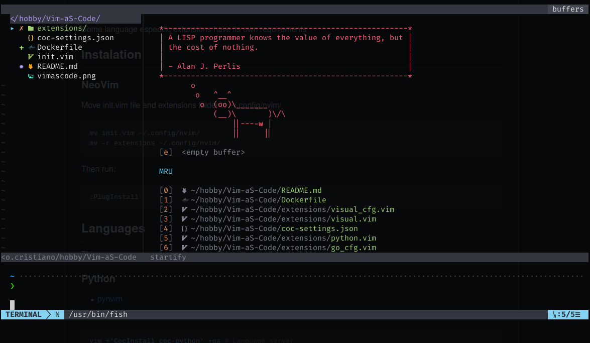
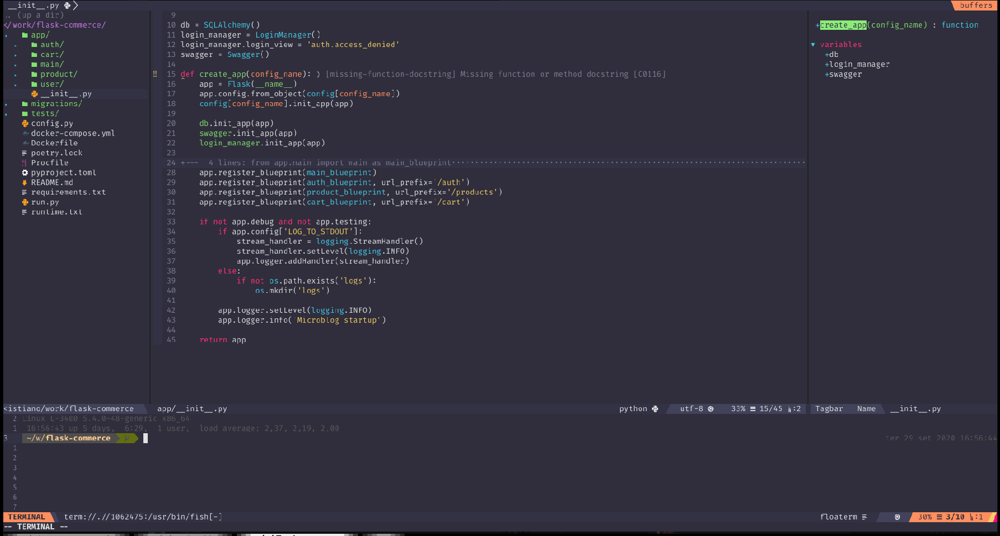

# Vim aS Code

NeoVim inspired by VSCode

## Features

- Integrated terminal [Floaterm](https://github.com/voldikss/vim-floaterm)
- Completetions
- Tags [universal-ctags](https://github.com/universal-ctags/ctags)
- File explorer [NERDTree](https://github.com/preservim/nerdtree)
- Suport transparent background

<details>
<summary>Screenshot</summary>




</details>

## Base theme

- [sonokai](https://github.com/sainnhe/sonokai)

## Instalation

### Requirements

- [NeoVim](https://github.com/neovim/neovim)
- [vim-plug](https://github.com/junegunn/vim-plug/)
- [nodejs](https://nodejs.org/en/)
- [yarn](https://classic.yarnpkg.com/)
- [python3.9](https://www.python.org/)
  - [python3.9-venv](https://docs.python.org/3.9/library/venv.html)
  - [pynvim](https://github.com/neovim/pynvim)
  - [python-language-server](https://github.com/palantir/python-language-server) *optional
    - jedi *optional (?)
- [git](https://git-scm.com/)
- [fonts-powerline](https://github.com/powerline/fonts)
- [universal-ctags](https://github.com/universal-ctags/ctags)
- [ripgrep (rg)](https://github.com/BurntSushi/ripgrep)

Some language especific extensions have its own requirements

1. Install requirements

    On Linux (Ubuntu / Debian like)

    ```sh
    sudo apt-get update
    sudo apt-get install -y git curl nodejs neovim python3.9 python3.9-venv fonts-powerline universal-ctags ripgrep

    bash -c 'python3.9 -m venv --upgrade-deps ~/.virtualenvs/neovim/py3 && \
    source ~/.virtualenvs/neovim/py3/bin/activate && \
    pip install -U pynvim jedi python-language-server'

    sh -c 'curl -fLo "${XDG_DATA_HOME:-$HOME/.local/share}"/nvim/site/autoload/plug.vim --create-dirs \
        https://raw.githubusercontent.com/junegunn/vim-plug/master/plug.vim'

    curl -sS https://dl.yarnpkg.com/debian/pubkey.gpg | apt-key add -
    echo "deb https://dl.yarnpkg.com/debian/ stable main" | tee /etc/apt/sources.list.d/yarn.list
    apt-get install -yq yarn
    ```

2. Config files and extensions folder to ~/.config/nvim/

    ```sh
    git clone https://github.com/RCristiano/Vim-aS-Code.git ~/.config/nvim

    nvim +'PlugInstall --sync' +qa
    ```

## Languages

- This repo uses coc.nvim, so its compatible with any of its available [language servers](https://github.com/neoclide/coc.nvim/wiki/Language-servers).

### Python

```sh
nvim +'CocInstall coc-pyright'
```

### GO

Go extensions was configured using this [guide](https://octetz.com/docs/2019/2019-04-24-vim-as-a-go-ide/).

#### tl;dr

Set `$GOBIN` and `$GOPATH` variables and add `$GOBIN` to your `$PATH` and run:

```sh
nvim +PlugInstall +GoInstallBinaries +CocConfig
```

and paste the content present in `coc-settings.json` present in this repo.

- All files are inserted when git clone in the setup at [installation](#Instalation)

- This file is configured to work with Kubernetes yaml files as well, to make it fully functional, you can run `:CocInstall coc-yaml`. (if you wont use it, simply remove `yaml.schemas` section)

### Elixir

```sh
nvim +`CocInstall coc-elixir`
```

## Mappings (WIP)

| keymap    | Type        | Description                |
| :-------- | :---------- | :------------------------- |
| `Ctrl+b`   | NERDTree    | File explorer toggle       |
| `Ctrl+j`   | Floaterm    | Integrated terminal toggle |
| `F3`      |             | Numbers toggle format      |
| `F4`      |             | Numbers toggle on/off      |
| `F8`      |             | TagBar toggle              |

## Docker

```sh
 # Build from local
docker build . -t vimascode \
    --build-arg LANG \
    --build-arg LANGUAGE \
    --build-arg UNAME=$(whoami) \
    --build-arg USER_ID=$(id -u) \
    --build-arg GROUP_ID=$(id -g)

 # Then run, you can change $PWD to any dir
docker run --it -v $PWD:/mnt/workdir vimascode
```

- [] Substituir coc por language servers
- [] Floaterm possui uma integração interesante com o fzf
https://www.vimfromscratch.com/articles/vim-for-python/
